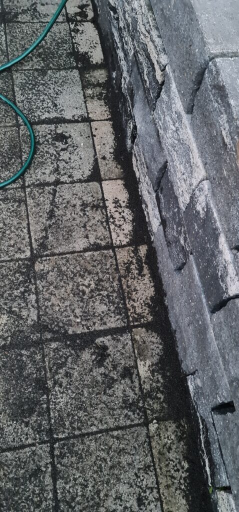
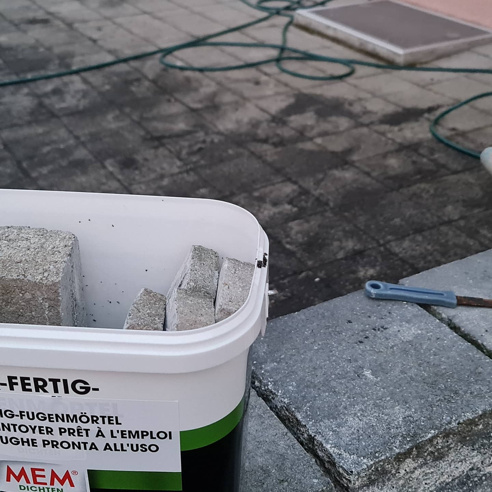

Ein altes Projekt endlich beendet. Der Abschluss der Pflastersteine zur Mauer war ein Jahr lang nun mit Kies gefüllt, das hat so mittelmässig ausgesehen, aber funktioniert. Nun haben aber die Kinder ständig mit den Kies gespielt, und auch optisch hat es mich nun lange genug gestört. Mrssen, zeichnen, trennen und dann legen. Getrennt habe ich mit einem Billig-Winkelschleifer und einer Diamanntscheibe, das geht wie durch Butter.

FENSTER SCHLIESSEN! (Ich rede aus Erfahrung)

Getrimmte Pflastersteine

Zudem habe ich, analog letztem Jahr, die Fugen mit MEM-Fugensand verschlossen. Diese Sand-Kunstharz-Mischung funktioniert recht gut, trotzdem wäscht sie ein wenig aus und Moos setzt auch ein wenig an. Allerdings viel weniger als ohne.

